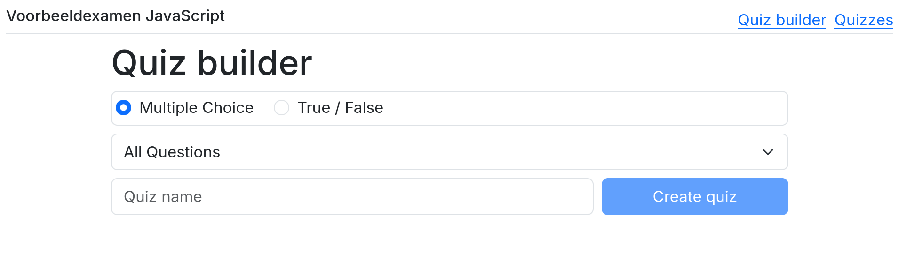
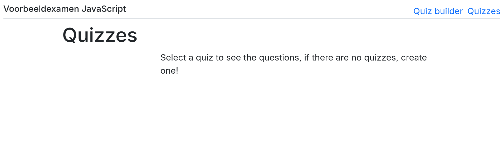
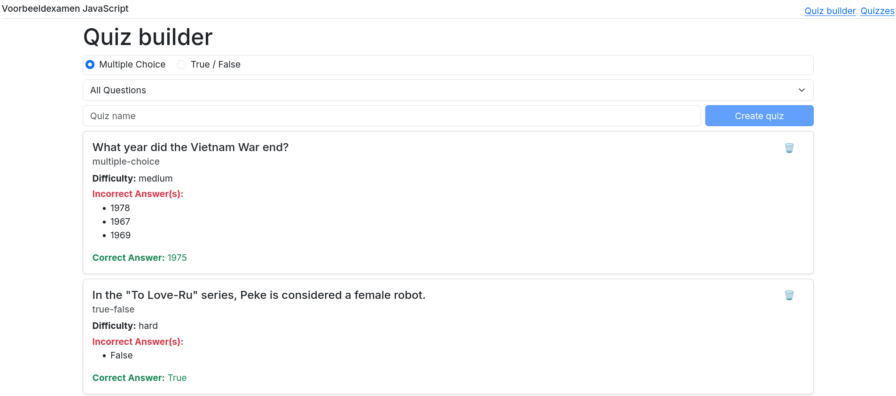
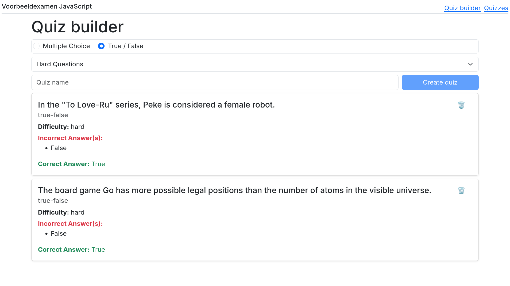
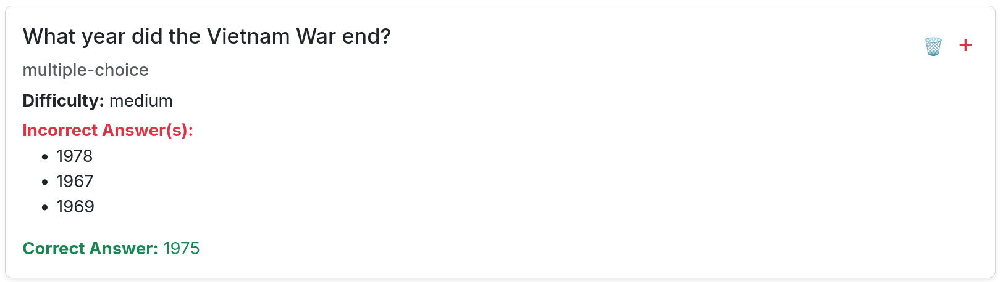
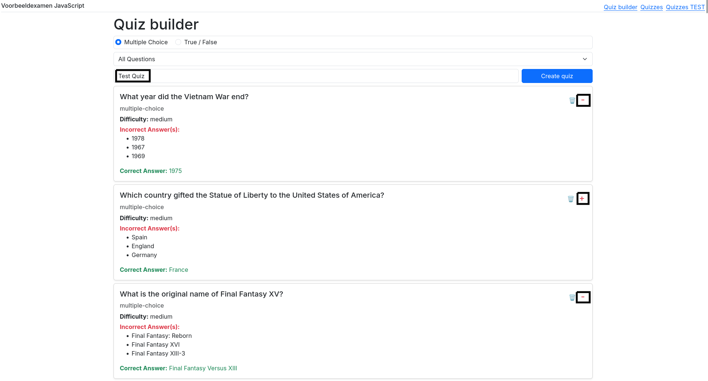
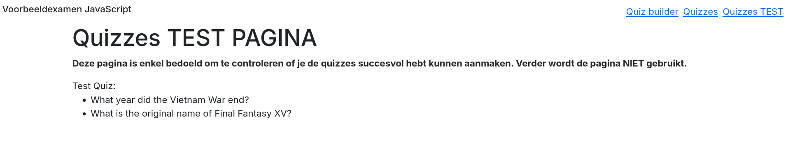
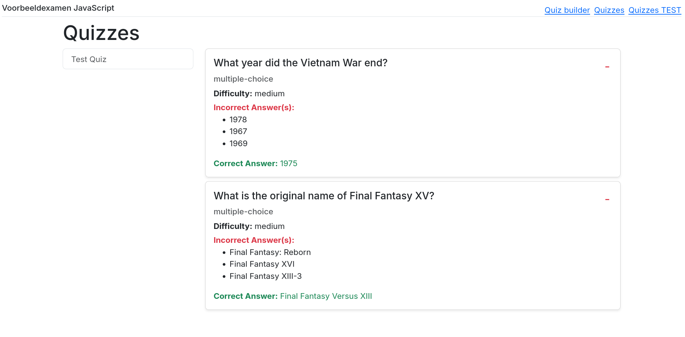

# Examen JavaScript 2025

Tijdens dit examen bouw je een applicatie waarmee een trivia vragen beheerd kunnen worden en waarmee quizzes gemaakt
kunnen worden op basis van deze vragen.

Download de startbestanden.
Deze bevatten twee folders, de _frontend_ map is de map met het JavaScript project waarin je code moet toevoegen, de
_server_ map bevat een API die één route bevat (http://localhost:3000/questions) die alle CRUD-operaties ondersteunt
voor de vragen.
Verder bevatten de startbestanden ook _Question_ en _Quiz_ interfaces die de data in de applicatie beschrijven.

## Routing (1 punt)

De startbestanden bevatten een custom element dat een navigatiebalk bevat, zorg ervoor dat dit element geregistreerd is
bij de browser en bovenaan de _home_ en _quizzes_ pagina's staat.
Voor deze laatste pagina is de meeste code al voorzien in de startbestanden.

Zorg er tenslotte voor dat beide pagina's bereikbaar zijn via de navigatiebalk.
De home pagina is beschikbaar via `/` en de quizzes pagina via `/quizzes`.

## Vragen renderen (4 punten)

Gebruik de API om alle vragen in de database op te halen en deze weer te geven op de home pagina.
Gebruik de HTML-code die je in de startbestanden vindt om een custom element te bouwen dat de informatie over één
vraag weergeeft.
**Maak verplicht gebruik van de **_RestPersistenceProvider_** om de vragen op te halen.**

TIP: Je kan enkel strings doorgeven als properties aan een custom element en de properties van moeten in _kebab-case_ 
(kleine letters en liggend streepje) geschreven zijn en niet in _camelCase_.

## Vragen filteren (3 punten)

Gebruik de radio input (type vraag) en de dropdown (moeilijkheidsgraad) om de vragen te filteren.
De filters moeten allebei tegelijkertijd werken.

## Vragen verwijderen (2 punten)

Als er op het vuilbakje geklikt wordt, moet de vraag (via de API) verwijderd worden uit de database, natuurlijk moet
deze aanpassing ook zichtbaar zijn in de UI.
**Maak verplicht gebruik van de **_RestPersistenceProvider_** om de vragen op te verwijderen.**

## Vragen toevoegen aan een quiz (3 punten)

De gebruiker heeft de mogelijkheid om vragen te selecteren en deze toe te voegen aan een quiz.
Het custom element dat de vragen weergeeft bevat een knop naast het vuilbakje.
Als de vraag nog niet in de quiz zit, moet een + teken getoond worden, als de vraag al in de quiz zit moet er een -
teken getoond worden.

Maak gebruik van een **custom event** om een druk op de knop door te geven aan de parent component.
Ook hier zorg je dat de aanpassing direct zichtbaar is in de UI.

## Quiz aanmaken (4 punten)

Als er minstens één vraag toegevoegd is aan de quiz wordt de "Create quiz" knop actief, in het andere geval moet deze
disabled zijn.
Als er op de knop gedrukt wordt, moeten alle geselecteerde vragen in een nieuwe quiz gestopt worden, de naam van deze
quiz wordt meegegeven via een input-veld.
De quizzes moeten bewaard worden in **localStorage**, **je maakt hier verplicht gebruik van de
_LocalStoragePersistenceProvider_ en de storagekey _quizzes_**.

Na het aanmaken van een quiz worden de geselecteerde vragen en het input-veld leeggemaakt en kan de gebruiker een nieuwe
quiz aanmaken.

De startbestanden bevatten een testpagina die je kan gebruiken om te controleren of de quiz correct aangemaakt wordt.
Er staan geen punten op het gebruik van deze testpagina, de pagina is louter een hulpmiddel om te controleren of
je code correct werkt.

**Quiz in opbouw met twee geselecteerde vragen:**

**Aangemaakte quiz:**

## Quizzes weergeven (1 punten)

De quizzes pagina is al grotendeels gegeven in de startbestanden.
Breid de gegeven code uit zodat de vragen die in de quizzes zitten zichtbaar worden (je kan hiervoor grotendeels
dezelfde code gebruiken als voor de vragen op de home pagina).

Het vuilbak icoon in het question element moet verborgen worden op de quizzes pagina, maar moet nog wel zichtbaar
blijven op de home pagina.
De knop waarmee je de vragen kon toevoegen aan of verwijderen van de quiz moet nog wel zichtbaar blijven.

## Quiz updaten (2 punten)

Via de '-' knop moet een vraag uit **de quiz** verwijderd worden.
Deze knop verwijdert de vraag enkel uit de quiz, **niet** uit de database (zoals op de home pagina), je moet hiervoor
dus enkel de data in **localStorage** aanpassen.

