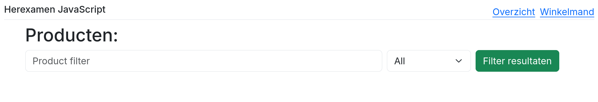
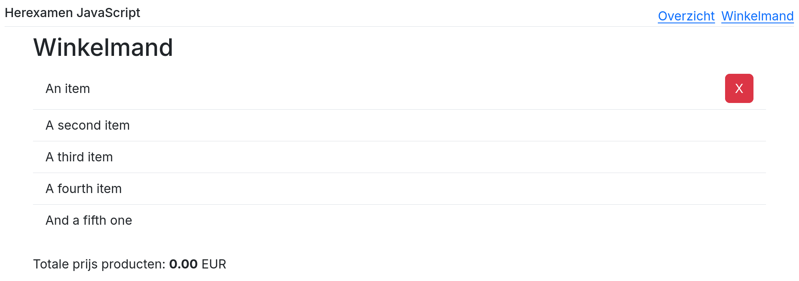
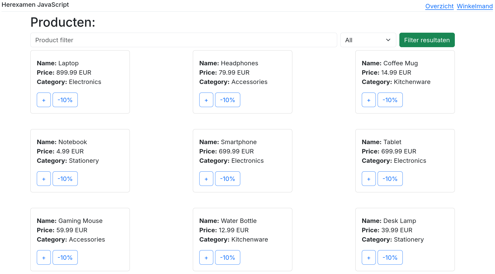
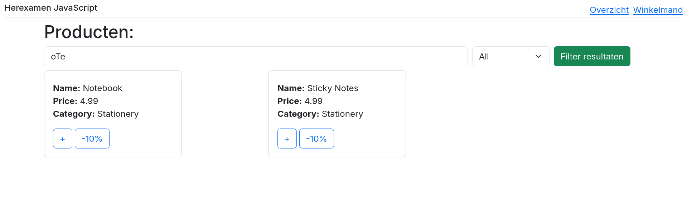
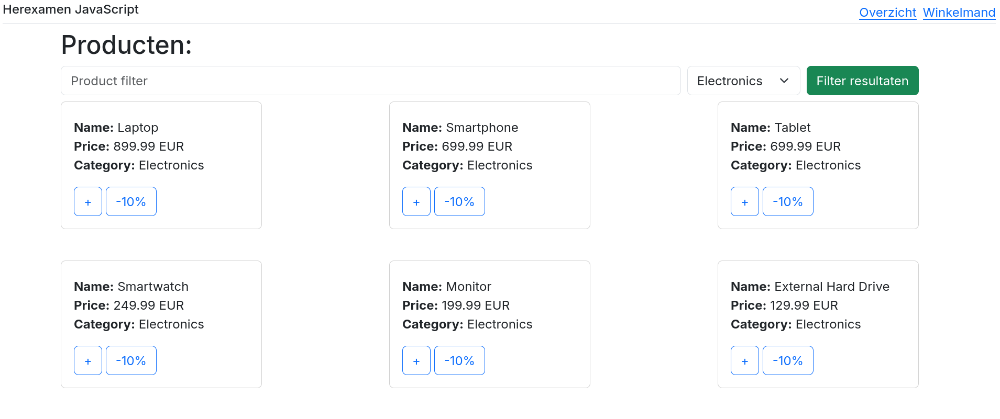
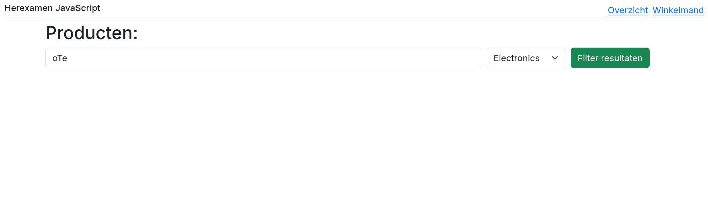
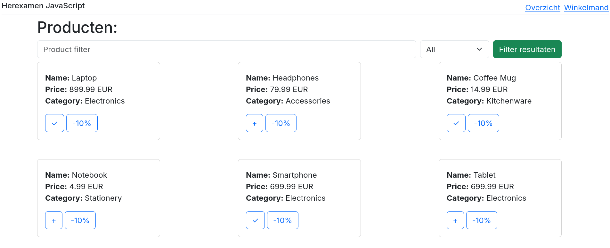
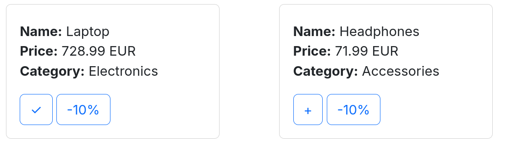
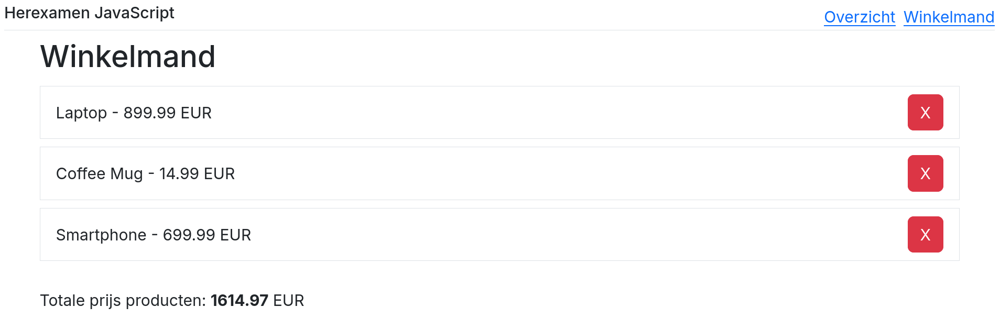
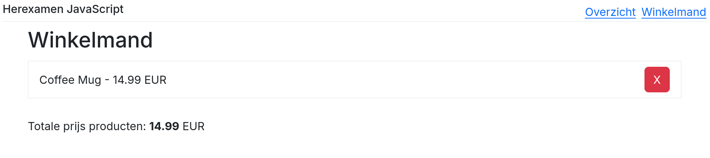

# Herexamen 2024-2025

Tijdens dit examen bouw je een pagina waarop je overzicht kan raadplegen van de verschillende producten in de database. Je zal ook een winkelmandje opbouwen in het lokaal geheugen.

**Je wordt niet beoordeeld op de opmaak (lay-out) van je code.
Als deze niet 100% overeenkomt met de screenshots is dit dus geen probleem.
Je wordt enkel beoordeeld op de functionaliteit.**

Maak doorheen het volledige examen gebruik van TypeScript, zorg ervoor dat de volledige applicatie strongly typed is.

Doorheen het volledige examen is het de bedoeling dat elke wijziging meteen zichtbaar is na het drukken op de knop.

TIP: raak je op een bepaald moment vast omdat je 'rommeldata' hebt, probeer dan eerst om de localstorage data van de localhost te verwijderen in je browser (vraag aan je docent indien onduidelijk),
en de inhoud van products.json in server/src/data te vervangen door het origineel (backupProducts.json).

## Pagina's & componenten (1 punt)

De startbestanden bevatten twee pagina's en drie custom elementen.
Zorg ervoor dat de pagina's bereikbaar zijn op '/' en '/cart'.
Je toont de producten pagina op de root en de winkelmandje pagina op '/cart'.

Zorg er verder ook voor dat de custom elements geregistreerd worden, voor de navbar gebruik je de naam `custom-navbar`,
voor de andere elementen kan je zelf een naam kiezen.
Zorg ervoor dat de links in de navbar correct werken.

TIP: voorzie voor elk van deze componenten en pagina's al een TypeScript bestand met de juiste functie die voorlopig enkel de html toont.
Op deze manier kan je alles al correct oproepen en je werk testen.
De inhoud werk je af later in dit examen en telt nog niet mee voor de punten van deze vraag.

_Producten (home) pagina_

_Winkelmand pagina_

## Producten pagina

### Producten inladen en renderen (5 punten)
Gebruik de API (http://localhost:3000/products) om alle producten in de database op te halen en deze weer te geven op de home pagina.
Gebruik de HTML-code die je in de startbestanden vindt (productCard/product.html) om een custom element te bouwen dat de informatie over één product weergeeft.

Maak verplicht (en zoals aangeleerd in de cursus) gebruik van de RestPersistenceProvider om de producten op te halen.

Maak voor elk product een nieuwe instantie van het custom element en voeg deze toe op de correcte plaats om de producten te tonen.

Om de maximumscore op deze vraag te behalen moeten de custom events nog niet afgewerkt zijn, de properties wel.

TIP: Je kan enkel strings doorgeven als properties aan een custom element en de properties ervan moeten in kebab-case (kleine letters en liggend streepje) geschreven zijn en niet in camelCase.

### Producten filteren (2 punten)
Zorg ervoor dat de producten gefilterd kunnen worden op basis van de categorieën en de naam.
Ook een combinatie moet correct werken.
Om het maximum te halen op deze vraag moet je ook op een deel van de naam kunnen zoeken, en mag de filter niet hoofdlettergevoelig zijn.
De data moet pas gefilterd worden als je op de knop drukt, je moet dus niet filteren bij elke toetsaanslag.

TIP: zet de filter in een aparte functie om je code beter leesbaar te houden.

_Filter op naam_

_Filter op categorie_

_Filter op naam en categorie_

### Producten toevoegen aan winkelmandje (3 punten)
Gebruik een custom even in de productCard om een product toe te voegen aan het winkelmandje.
Maak verplicht (en zoals aangeleerd in de cursus) gebruik van de LocalStoragePersistenceProvider om het winkelmandje op te slaan.
Zorg ervoor dat het symbool op de knop wijzigt naar een checkmark (&check;) wanneer het product al in het winkelmandje zit.

### Korting toepassen (2 punten)
Gebruik een custom event in de productCard om een korting toe te passen op het product.
Maak verplicht (en zoals aangeleerd in de cursus) gebruik van de RestPersistenceProvider om de korting op te slaan in de database.

De (makkelijkste) formule voor de korting is: `nieuwePrijs = prijs * 0.9`.

TIP: omdat de waarde rechtstreeks wordt aangepast in het json bestand, is deze wijziging permanent.
Wil je toch resetten, dan kan je gebruik maken van backupProducts.json in de server/src/data map.

_Korting 2 keer toegepast op de laptop, één keer op de headphones_

## Winkelmandje pagina

### Winkelmandje inladen en renderen (4 punten)
Maak verplicht (en zoals aangeleerd in de cursus) gebruik van de LocalStoragePersistenceProvider om het winkelmandje in te laden en weer te geven op de winkelmandje pagina.

Gebruik het custom element `cartItem` om de informatie over één product weer te geven in het winkelmandje.
Gebruik een template literal om de naam en prijs van het product in 1 regel weer te geven.
Toon ook de totaalprijs.

Om de maximumscore op deze vraag te behalen moet de event nog niet afgewerkt zijn, de properties wel.

### Producten verwijderen uit winkelmandje (3 punten)
Maak verplicht (en zoals aangeleerd in de cursus) gebruik van de LocalStoragePersistenceProvider om producten te verwijderen uit het winkelmandje.

Dit keer mag je geen custom event gebruiken als je de maximumscore wil behalen, maar spreek je rechtstreeks de correcte persistentie provider aan.

_Laptop & Smartphone verwijderd uit het winkelmandje_

